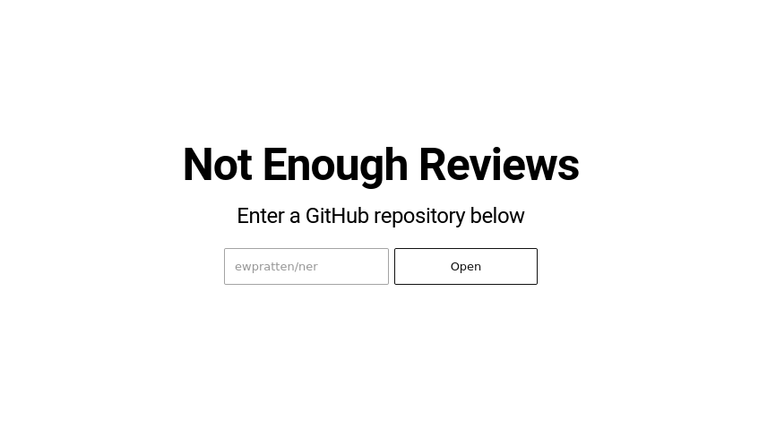
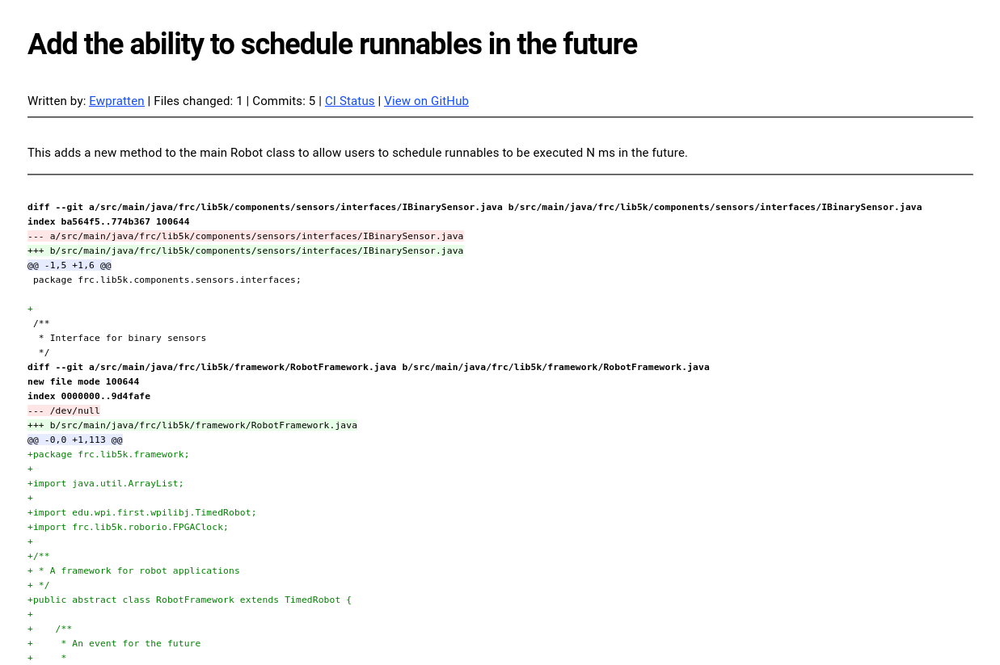

# **N**ot **E**nough **R**eviews

[Not Enough Reviews](https://ner.retrylife.ca) (NER) is a serverless frontend to public facing GitHub repositories. I really like the style and asthenic of the *old time-y* builtin boards, mailing lists, and patch files. The aim of this project is to bring some of my commonly used GitHub features "back" to be text-based, and to generally feel like I am working on software through a mailing list. Design of NER is heavily inspired by [git.kernel.org](https://git.kernel.org) and [lkml.org](https://lkml.org/), with some modern CSS of course.

## Features

As of now, NER comes with the following:

 - A project README viewer
 - A truncated commit log
   - Commit patches
 - An issues list
   - Formatted similar to emails
 - A "proposals" list (Pull Requests)
   - Includes syntax-highlighted commit diffs
 - A project dashboard
   - This is a real-time-ish log of project activity
   - I designed this to be projected on a screen in a workshop

## Screenshots

*Home Page*

*A proposal*